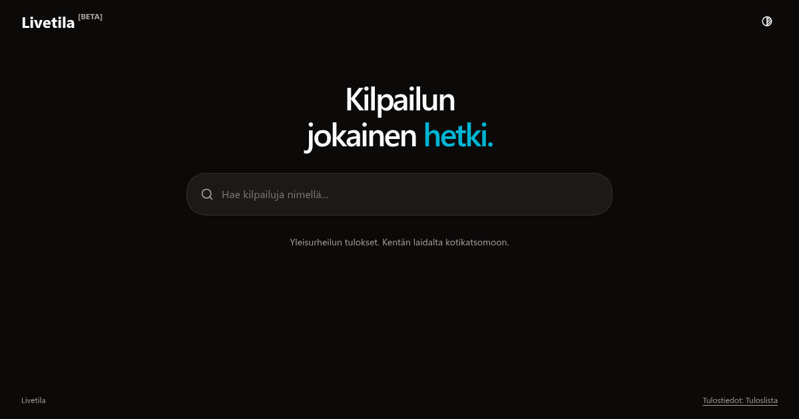

[Livetila](https://livetila.vercel.app) is a web app for following athletics competitions live. It uses the public [Tuloslista](https://tuloslista.com) API, so you can search for a competition, pick an event and watch the results update as they come in. It can also turn any event into an overlay for OBS, so live streams can show results on screen.

I started it in August 2023, and it has gone through three frameworks since. This September it got its biggest rewrite yet, so it felt like a good time to write about it.

## What it does

- Search competitions and events, including qualifying rounds and finals.
- See entrants, start lists, heat results and overall results for each event.
- Refresh results and event status every second while you're watching.
- Copy an OBS browser-source URL for the round and heat you're looking at.
- Light, dark and system themes, plus haptic feedback on phones that support it.

The interface is in Finnish.

## OBS overlays

Overlays have been part of Livetila since the very first version. Every event has an overlay page with a transparent background. Add it to OBS as a browser source and it sits on top of the stream, updating by itself.

```text
/obs/[competitionId]-[eventId]?round=2&heat=1
```

`round` and `heat` are one-based positions, so the URL above shows the first heat of the second round. Leave out `heat` to show the round's overall results, and leave out `round` to use the first round. You don't have to build these by hand: the OBS button in the viewer copies the URL for whatever round and heat you have selected.

New results animate in, so viewers can see when something changes.

## Live data is just polling

In January I tried pushing updates with tRPC subscriptions over WebSockets. After a few days of testing I went back to plain polling. Asking the API every second turned out to be good enough, and it's much simpler.

Livetila uses [TanStack Query](https://tanstack.com/query) for this. The results query refetches every second, whatever the event's status says:

```ts
const liveInterval = 1000

results: (slug: string, background: boolean) =>
  queryOptions({
    queryKey: ['athletes', competitionId, eventId],
    queryFn: ({ signal }) =>
      api.getAthletes(`${competitionId}/${eventId}`, signal),
    refetchInterval: liveInterval,
    // OBS keeps polling even when its source isn't visible
    refetchIntervalInBackground: background,
  })
```

A few details made this work well:

- **The competition view only polls while the tab is visible.** The OBS overlay keeps polling in the background, because OBS can hide a browser source without closing it.
- **A failed refresh keeps the last good results on screen.** A small status message says updates were interrupted, and it clears after the next successful refresh. The page only shows an error if the very first request fails.
- **Requests you no longer need get cancelled.** The `signal` above aborts the fetch when you navigate away, and cached data carries over between pages.

"Every second" isn't an end-to-end guarantee, though. The API has its own cache, and the network and the browser can add a bit of delay on top.

## Three frameworks in three years

Livetila has been rewritten more times than I'd like to admit:

- **2023:** Next.js 13 with the Pages Router, [tRPC](https://trpc.io), React Query and Tailwind 3. The first version already had competition search, the results view and the OBS overlay, with a tRPC server passing requests along to Tuloslista.
- **2024:** I moved it to the App Router and added animations when new results arrive on the overlay.
- **2025–2026:** Splitting heats in the overlay URL, a mobile-friendly competition view, better search, the WebSocket experiment, the one-second polling and haptic feedback.
- **2026:** A full rewrite to SvelteKit.

The SvelteKit version is a static single-page app with no server at all. The browser talks to the Tuloslista API directly, so the whole tRPC layer is gone. It uses Svelte 5 runes, TanStack Svelte Query, Tailwind 4 and shadcn-svelte, and it's hosted on Vercel as plain static files.

It also has proper tests now. Playwright runs regression tests against the production build, using saved API responses so the tests don't depend on a competition happening to be live.

## Conclusion

Livetila is still in beta, but it's the version I'm happiest with so far. If you follow Finnish athletics or stream competitions, [give it a try](https://livetila.vercel.app). The code is on [GitHub](https://github.com/kamm3r/livetila), and I'd love to hear what you think.
